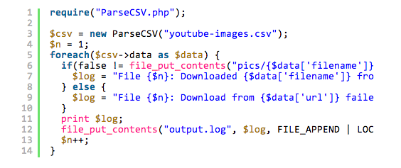

# WP-Gistpen #
**Contributors:** JamesDiGioia
**Donate link:** http://jamesdigioia.com/
**Tags:** gist, code snippets, codepen
**Requires at least:** 3.9
**Tested up to:** 3.9.1
**Stable tag:** 0.3.0
**License:** GPLv2
**License URI:** http://www.gnu.org/licenses/gpl-2.0.html

A self-hosted alternative to putting your code snippets on Gist.

## Description ##

You use WordPress because you want control over your writing. Why give Gist or Codepen your code snippets? WP-Gistpen is a self-hosted replacement for your WordPress blog.

## Installation ##

### Using The WordPress Dashboard ###

1. Navigate to the 'Add New' in the plugins dashboard
2. Search for 'wp-gistpen'
3. Click 'Install Now'
4. Activate the plugin on the Plugin dashboard

### Uploading in WordPress Dashboard ###

1. Download `wp-gistpen.zip` from the WordPress plugins repository.
2. Navigate to the 'Add New' in the plugins dashboard
3. Navigate to the 'Upload' area
4. Select `wp-gistpen.zip` from your computer
5. Click 'Install Now'
6. Activate the plugin in the Plugin dashboard

### Using FTP ###

1. Download `wp-gistpen.zip`
2. Extract the `wp-gistpen` directory to your computer
3. Upload the `wp-gistpen` directory to the `/wp-content/plugins/` directory
4. Activate the plugin in the Plugin dashboard

## Frequently Asked Questions ##

### How do I create a Gistpen and insert it into the post? ###

WP-Gistpen registers a new `gistpens` post type. Instead of posting your public code snippets on Gist, go to Gistpens -> Add New, and paste in your code.

You can also create and insert a Gistpen directly into your post/page from the visual editor by clicking the pen button. From the pop-up, select one of the recent Gistpens or create a new one by pasting in your code and clicking "Insert".

After inserting the shortcode, your code will appear in your post, highlighted by [PrismJS](http://prismjs.com).

### How do I highlight specific lines in my Gistpen? ###

To highlight a specific line, add `highlight="##"`, where ## is a line number or range of numbers you want highlighted, like this ([via PrismJS documentation](http://prismjs.com/plugins/line-highlight/)):

* A single number refers to the line with that number
* Ranges are denoted by two numbers, separated with a hyphen (-)
* Multiple line numbers or ranges are separated by commas.
* Whitespace is allowed anywhere and will be stripped off.

Examples:

* `highlight="5"`: The 5th line
* `highlight="1-5"`: Lines 1 through 5
* `highlight="1,4"`: Line 1 and line 4
* `highlight="1-2,5,9-20"`: Lines 1 through 2, line 5, lines 9 through 20

Offset does not yet work but will be added soon.

### How do I link to a specific line? ###

You can link to a specific line in your Gistpen by linking to `#gistpen-{gistpen-slug}.{lines}`. The lines don't need to be highlighted in advance for the link to work, and they will be highlighted when the link is clicked. The `{lines}` should match the same format as above.

### What is the future of this plugin? ###

Eventually, I hope to make this plugin interoperable with Gist, allowing you to import your current Gists, fork other people's Gists into your Gistpen, and publishing your Gistpens to Gist.

Additionally, I want to make Gistpens embeddable on other websites the same way you can embed Gists, but both of those larger features are likely a long way off.

## Screenshots ##

The Insert Gistpen dialog after you click the pen in the visual editor.

Default theme - How your code will appear in your post.

Twilight theme with line numbers enabled. Check out all the themes at [PrismJS.com](http://prismjs.com).

The current options page.
