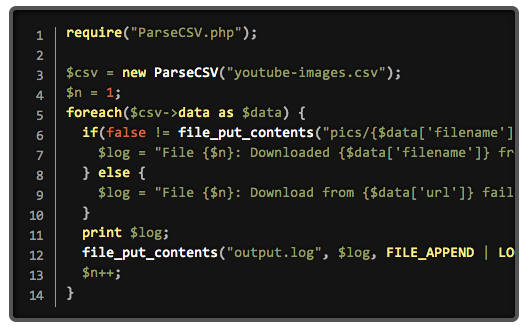
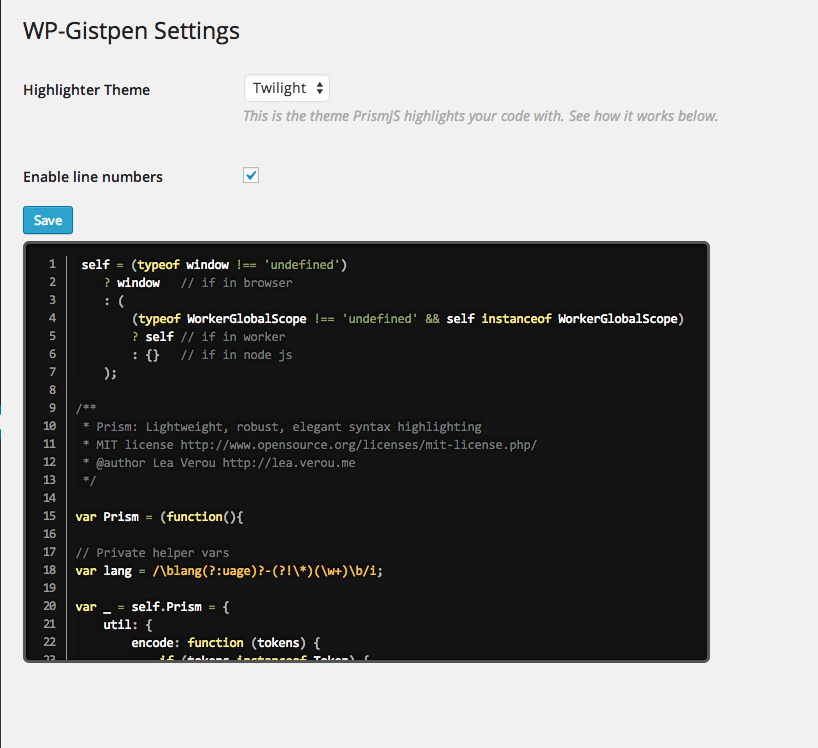
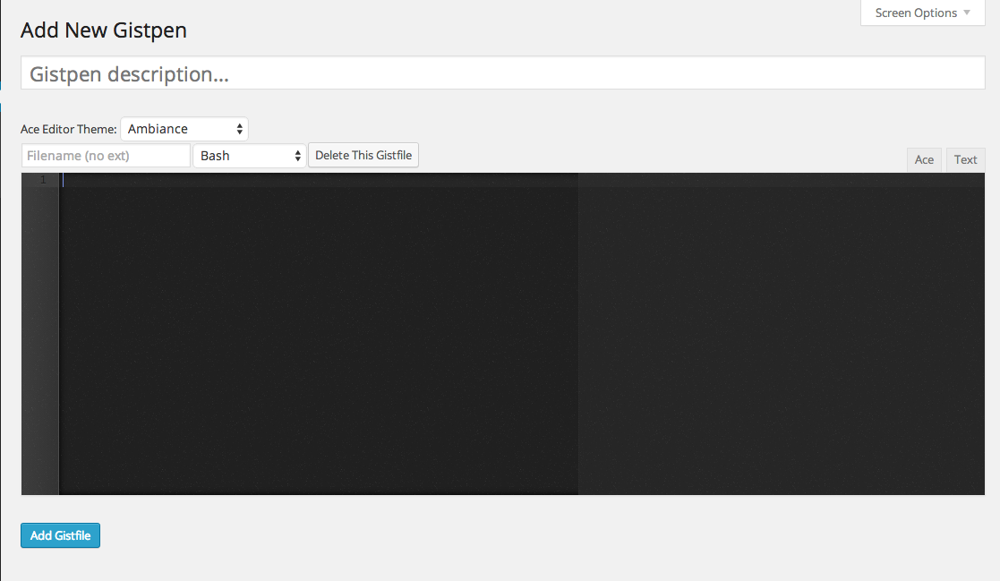
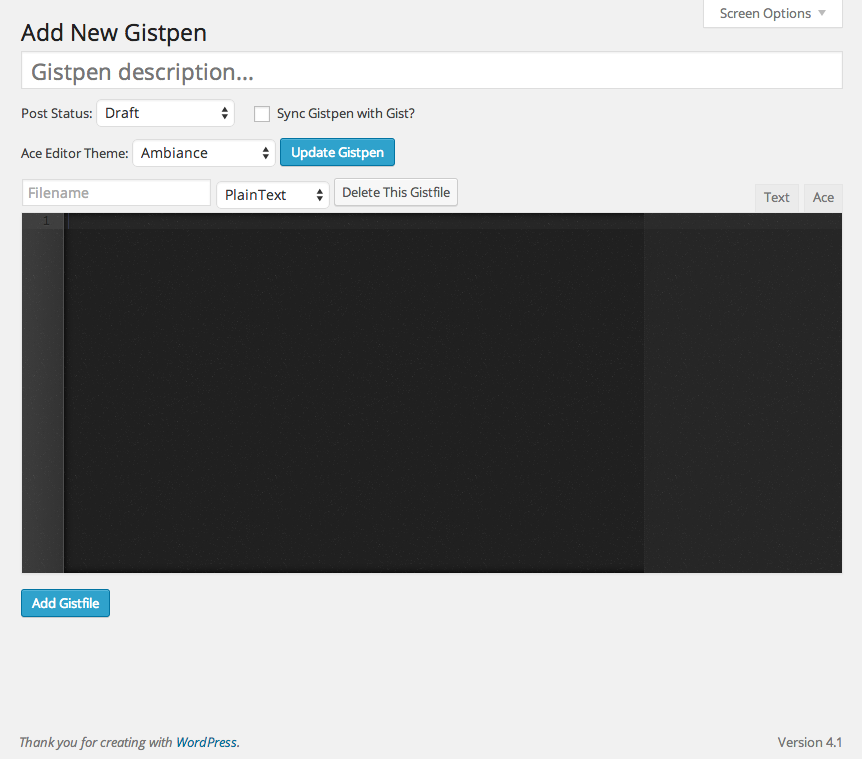

# WP-Gistpen #

**Contributors:** JamesDiGioia  
**Donate link:** http://jamesdigioia.com/  
**Tags:** gist, code snippets, codepen  
**Requires at least:** 4.6  
**Tested up to:** 4.8  
**Stable tag:** 1.0.0-alpha.8  
**License:** GPLv2  
**License URI:** http://www.gnu.org/licenses/gpl-2.0.html  

## Description ##

A self-hosted alternative to putting your code snippets on Gist.

  

You use WordPress because you want control over your writing. Why give Gist or Codepen your code snippets? WP-Gistpen is a self-hosted replacement for your WordPress blog.

Features include:

* Revision saving
* Gist import & export
* ACE editor
* PrismJS syntax highlighting
* Supported Languages
	- Assembly (NASM)
	- ActionScript
	- AppleScript
	- Bash
	- C
	- Coffeescript
	- C#
	- CSS
	- Dart
	- Eiffel
	- Erlang
	- Gherkin/Cucumber
	- Git/Diff
	- Go
	- Groovy
	- HAML
	- Handlebars
	- HTML
	- HTTP
	- ini
	- Jade
	- Java
	- JavaScript
	- LaTeX
	- LESS
	- Markdown
	- Matlab
	- Objective-C
	- Perl
	- PHP
	- PlainText
	- PowerShell
	- Python
	- R
	- Rust
	- Ruby
	- Sass
	- Scala
	- Scheme
	- Smarty
	- Sql
	- Swift
	- Twig
	- XML

## Installation ##

### Using the WordPress Dashboard ###

1. Navigate to the 'Add New' in the plugins dashboard
2. Search for 'wp-gistpen'
3. Click 'Install Now'
4. Activate the plugin on the Plugin dashboard

### Uploading in WordPress Dashboard ###

1. Download `wp-gistpen.zip` from the WordPress plugins repository.
2. Navigate to the 'Add New' in the plugins dashboard
3. Navigate to the 'Upload' area
4. Select `wp-gistpen.zip` from your computer
5. Click 'Install Now'
6. Activate the plugin in the Plugin dashboard

### Using FTP ###

1. Download `wp-gistpen.zip`
2. Extract the `wp-gistpen` directory to your computer
3. Upload the `wp-gistpen` directory to the `/wp-content/plugins/` directory
4. Activate the plugin in the Plugin dashboard

## Frequently Asked Questions ##

### What are the plugin's requirements? ###

First, revisions need to be enabled. They can be disabled in `wp-config.php`, but WP-Gistpen relies on them to keep everything in sync. A future version will remove this dependency, but it's currently required.

Additionally, your PHP version should be 5.4+.

### How do I create a Gistpen and insert it into the post? ###

To add a new Gistpen, go to Gistpens -> Add New, and paste in your code. You can enable or disable Gist syncing on a a per-Gistpen basis.

You can also create and insert a Gistpen directly into your post/page from the visual editor by clicking the code button. From the pop-up, select one of the recent Gistpens, search your Gistpens, or create a new one by pasting in your code and clicking "Insert".

After inserting the shortcode, your code will appear in your post, highlighted by [PrismJS](http://prismjs.com).

### How do I highlight specific lines in my Gistpen? ###

To highlight a specific line, add `highlight=^^`, where ^^ is a line number or range of numbers you want highlighted, like this ([via PrismJS documentation](http://prismjs.com/plugins/line-highlight/)):

* A single number refers to the line with that number
* Ranges are denoted by two numbers, separated with a hyphen (-)
* Multiple line numbers or ranges are separated by commas.
* Whitespace is allowed anywhere and will be stripped off.

Examples:

* `highlight=5`: The 5th line
* `highlight=1-5`: Lines 1 through 5
* `highlight=1,4`: Line 1 and line 4
* `highlight=1-2,5,9-20`: Lines 1 through 2, line 5, lines 9 through 20

### How do I link to a specific line? ###

You can link to a specific line in your Gistpen by linking to `#gistpen-{gistpen-slug}.{lines}`. The lines don't need to be highlighted in advance for the link to work, and they will be highlighted when the link is clicked. The `{lines}` should match the same format as above.

### How do I get my Gist token from GitHub? ###

1. Login to GitHub.
2. Go to Settings -> Applications.
3. Under "Personal access tokens", click "Generate New Token."
4. Give it a name, click create
	* The default settings work, but make you sure you at least include the `gist` and `user` scopes.
5. Copy the generated token.
6. Paste it into the settings page.
7. ???
8. Profit!

### How do I sync my Gistpens to Gist? ###

Gistpens can be exported en masse from the Gistpens settings page. All Gistpens will be synced, only if the Gistpen hasn't been synced yet, but **regardless of whether syncing for the Gistpen is enabled**. Syncing will then be enabled on the exported Gistpens.

If you do not want this, you can enable/disable Gistpen syncing on a per-Gistpen basis. Just click the checkbox on the Gistpen edit page, and any changes will be reflected on the corresponding Gist on update. If you uncheck that box, future changes will not be reflected on Gist.

### What is the future of this plugin? ###

Eventually, I hope to make this plugin interoperable with Gist, allowing you to import your current Gists, fork other people's Gists into your Gistpen, and publishing your Gistpens to Gist.

Additionally, I want to make Gistpens embeddable on other websites the same way you can embed Gists, but both of those larger features are likely a long way off.

Essentially, the idea is to build a fully-featured Gist clone in WordPress

## Screenshots ##

The Insert Gistpen dialog after you click the pen in the visual editor.

Default theme - How your code will appear in your post.

Twilight theme with line numbers enabled. Check out all the themes at [PrismJS.com](http://prismjs.com).

The current options page.

The options page with a token saved.

Gistpen editor screen with Ace editor
